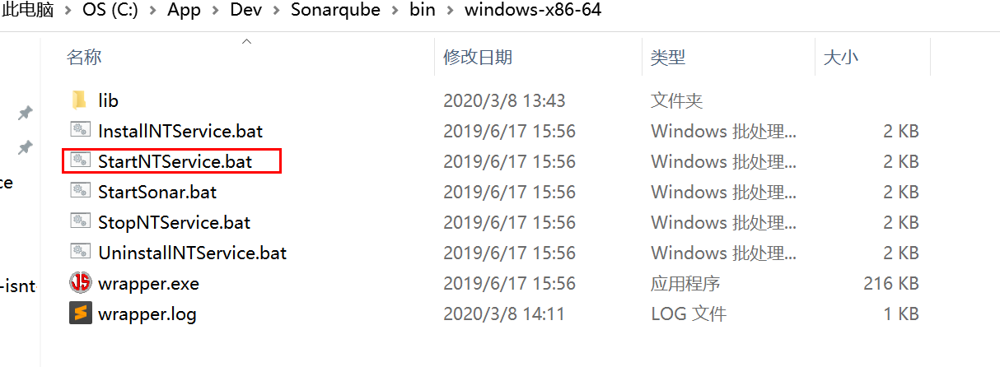
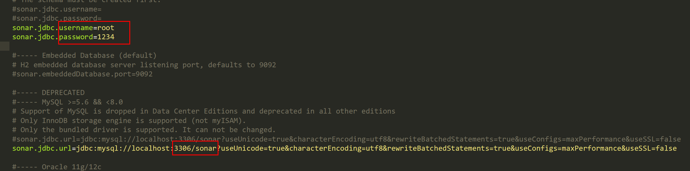
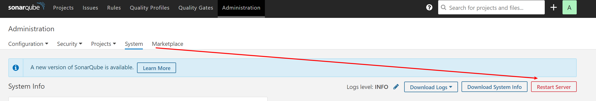
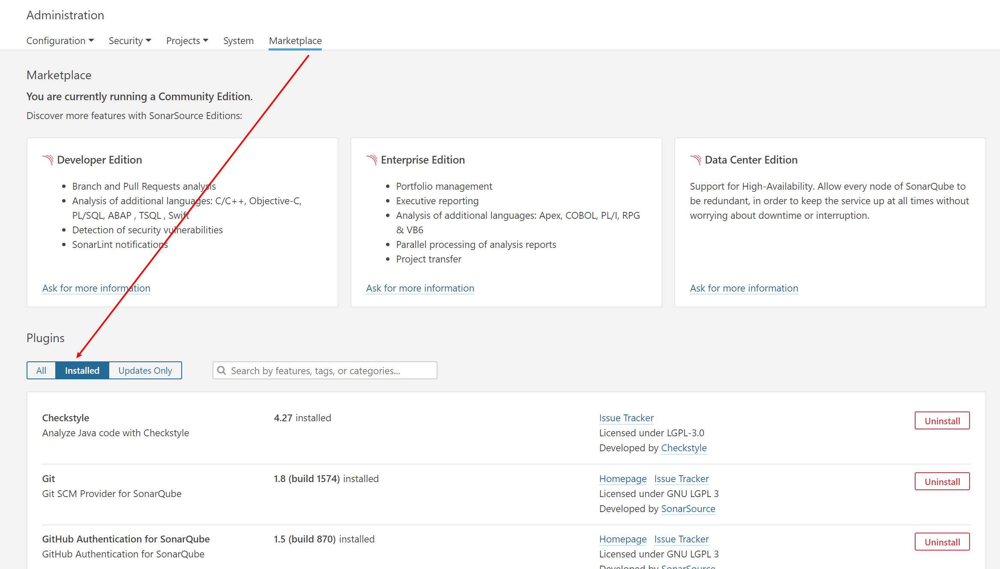
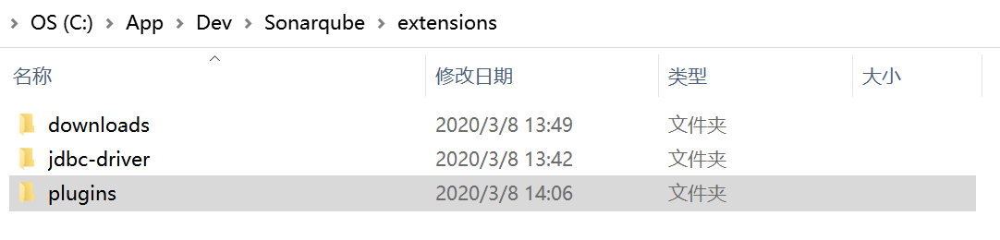

### <div align=center>Sonarqube With Java<div>

1. ##### Install

   - 官网下载对应版本的zip文件,建议选择使用[V-7.8](https://www.sonarqube.org/downloads/ ),因为sonarqube官方在7.9版本开始已经放弃对Mysql的支持,所以这里选择7.8版本;如果使用的是如Orcle,SQL server等数据库可以选择最新版本,注意最新版本需要jdk11的支持.

   - 下载zip解压到相应的目录,..\bin\windows-x86-64\目录内启动InstallNTService.bat脚本,之后通过StartNT和StopNT两个bat脚本控制sonar服务的启停;还可以直接通过StartSonar.bat直接控制台启动服务,但是启动后即使关闭控制台,服务仍然在运行,需要在任务管理器中kill掉所有的Java进程(这里先不要启动,等待配置好下面的数据库).

     

   - sonar内置了H2数据库,替换成自己的Mysql,需要修改config配置,同时为Mysql建立一个sonar的数据库,修改如下内容(服务启动后会自动在数据库创建表格数据等信息):

     

   ------

   

2. ##### Start

   上述内容配置好后,即可重新启动服务,如果之前没有启动则直接StartNT,查看本地9000端口,默认登陆账号密码admin/admin,自己修改即可;页面有restart按钮,可以重启服务,也可以通过bat脚本重启.

   

3. ------

   ##### Plugin

   - 安装java相关插件,正常时通过marketplace安装即可,但是插件版本较新与7.8不兼容,需要去github下载对应版本进行安装,插件地址:[plugins](https://github.com/SonarQubeCommunity?q=&type=&language=),按需下载对应的版本插件.

     

   - eg: [CheckStyle](https://github.com/checkstyle/sonar-checkstyle),[Mybatis](https://github.com/donhui/sonar-mybatis),下载对应的jar放到安装目录的plugins中,重启服务查看installed

     

4. ------

   ##### Maven

   - maven中配置sonar,这里直接配置在项目的pom.xml中,也可以配置在maven的config中,主要配置如下两部分内容:

   - sonar认证部分,sonar服务的ip和执行mvn扫描的项目都在同一台服务器上地时可以省略这个配置,如果不是则项目中需要配置sonar的ip地址端口,以及认证token,token是web页面权限管理生成.

     ```xml
     <properties>
     <sonar.login>token</sonar.login>
     <sonar.host.url>http://localhost:9000</sonar.host.url>
     </properties>
     ```

   - sonar过滤规则,对于某些不必要扫描以及单元测试覆盖的代码,可以通过exclude过滤排除

     ```xml
     <properties>
     <sonar.exclusions>
           **/annotation/*.java,
           **/common/**/*.java,
           **/config/*.java,
           **/controller/*.java,
           **/exception/*.java,
           **/interceptor/*.java,
           **/repository/*.java,
           **/security/*.java,
           **/service/*.java,
           **/util/*.java,
           **/Application.java
     </sonar.exclusions>
     </properties>
     ```

   - jococo依赖添加,方便扫描单元测试覆盖率

     ```xml
     <build>
     <plugins>
     <plugin>
           <groupId>org.jacoco</groupId>
           <artifactId>jacoco-maven-plugin</artifactId>
           <version>0.8.0</version>
           <executions>
               <execution>
                 <goals>
                   <goal>prepare-agent</goal>
                  </goals>
               </execution>
               <execution>
                    <id>report</id>
                    <phase>prepare-package</phase>
                     <goals>
                       <goal>report</goal>
                      </goals>
               </execution>
           </executions>
     </plugin>
     </plugins>
     </build>
     ```

5. ------

   ##### Scan

   项目pom同级目录下执行verify命令进行扫描项目,注意首先保证target已经生成,否则需要先package

   ```shell
   mvn verify sonar:sonar
   ```

6. ------

   ##### Lombok

   单元测试问题,项目中如果使用了[lombok](https://projectlombok.org/features/configuration)注解,需要jococo排除注解生成的方法,否则对于覆盖率问题造成误判,需要在项目根目录下建立lombok.config文件,添加如下内容:

   ```properties
   config.stopBubbling = true
   lombok.addLombokGeneratedAnnotation = true
   ```

   

